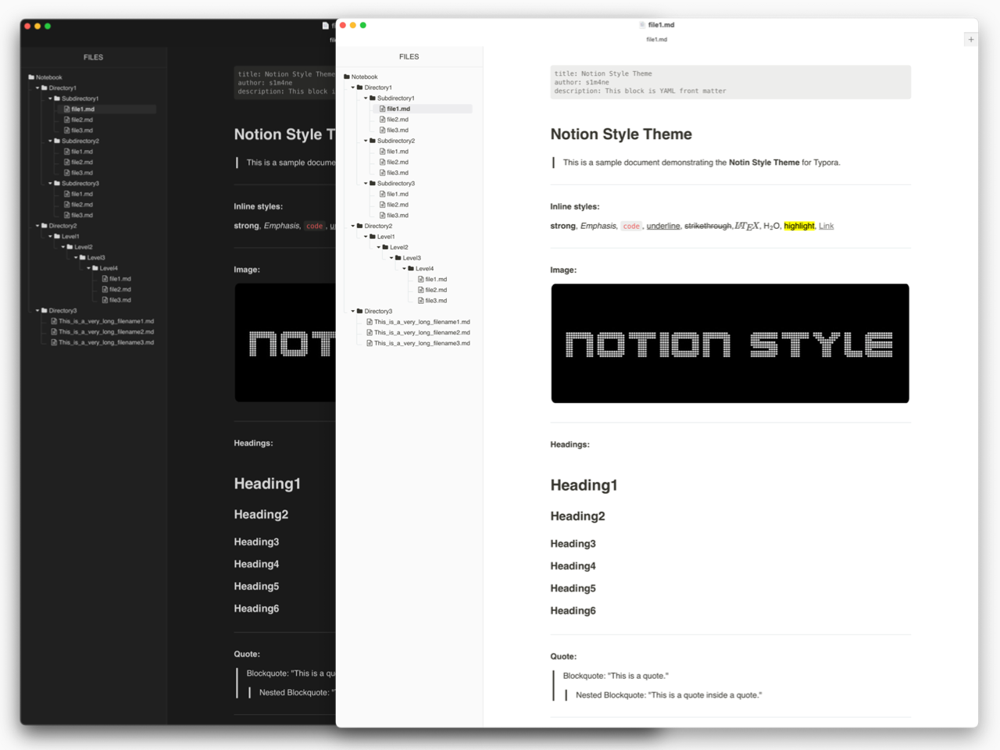
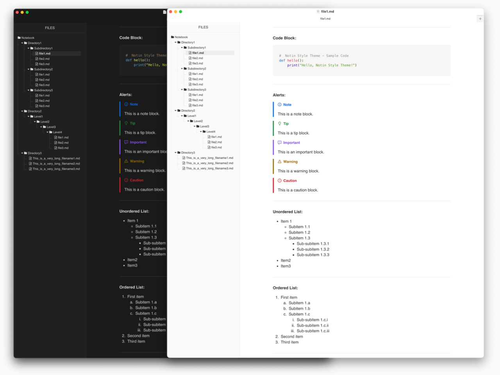
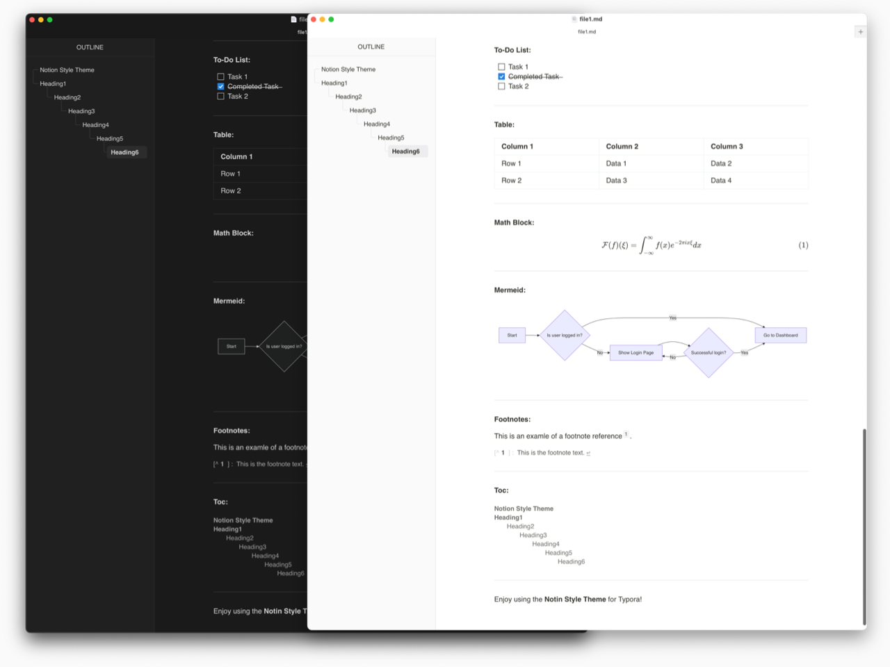

> Designed and tested on macOS. Not fully tested, but should work for Windows/Linux.But this theme does not include styles for Windows “unibody” style

This is a custom theme for the Markdown editor [Typora](https://typora.io/).

My custom Typora theme is now featured on the official site! 🎉
Check it out here: [Typora Themes](https://theme.typora.io/)

Feedback is always welcome! If you encounter any issues or have a suggestion, please don't hesitate to create an issue.

# Introduce

- **Notion-like design** for a clean and minimal look.
- **Compact file tree** to display more files and directories.
- **Precise replication** of Notion’s aesthetics.
- **Code-mode parity:** Typora’s Code/Source mode now shares the same syntax colors as fenced code, with visible line numbers by default.
- **Accessible links:** clearer blue link palette and focus outline for better discoverability.
- **Reduced-motion friendly:** honors `prefers-reduced-motion` to tone down animations.
- The file tree and outline styles are based on [Mdmdt](https://theme.typora.io/theme/Mdmdt/). Adjustments have been made to the size, color, and some elements to better integrate with the overall Notion-like theme.

## Code mode / Source view

- Line numbers are shown in Typora’s Code (Source) mode; fenced code blocks in the editor remain numberless for a clean look.
- Syntax colors, selection colors, and cursor styling match fenced code, so preview and Code mode stay visually consistent.
- If you want to adjust line-number color, edit `--code-block-bg-color` (background context) and the source-mode line-number color inside each theme CSS.

## Customization quick wins

- **Links:** tweak `--link-color`, `--link-hover-color`, and `--link-hover-bg` in each CSS file.
- **Line numbers (Code mode):** edit `.cm-s-typora-default .CodeMirror-linenumber` color/opacity.
- **Motion reduction:** the `@media (prefers-reduced-motion: reduce)` block can be tailored or removed if you prefer full animations.

# Preview

# Installation

Installing this theme is easy—just move the CSS file into Typora's theme directory.

### Steps to Install

1. Download the CSS file (`notion-style-light.css` or `notion-style-dark.css`) from this GitHub repository.

2. Open Typora and go to **`Settings` → `Appearance` → `Open Theme Folder`**.

3. Move the downloaded CSS file into the opened theme folder.

4. Restart Typora and go to **`Settings` → `Appearance`** to select the theme(`Notion Style Light` or `Notion Style Dark`).

Now the theme should be applied successfully.

# [Credits](credits.md)

This project is based on _Mdmdt_ for the secondary development of the file tree and outline design. Adjustments have been made to better fit the Notion-like aesthetics.

Special thanks to the creator of _Mdmdt_ for their great design and inspiration.

- [cayxc/Mdmdt](https://github.com/cayxc/Mdmdt)

# License

This project is licensed under the Apache License 2.0.
See the [LICENSE](LICENSE) file for details.

---

Hope you enjoy this theme! If you do, a ⭐ on [GitHub](https://github.com/s1m4ne/typora-theme-notion-style) would mean a lot. 😊
