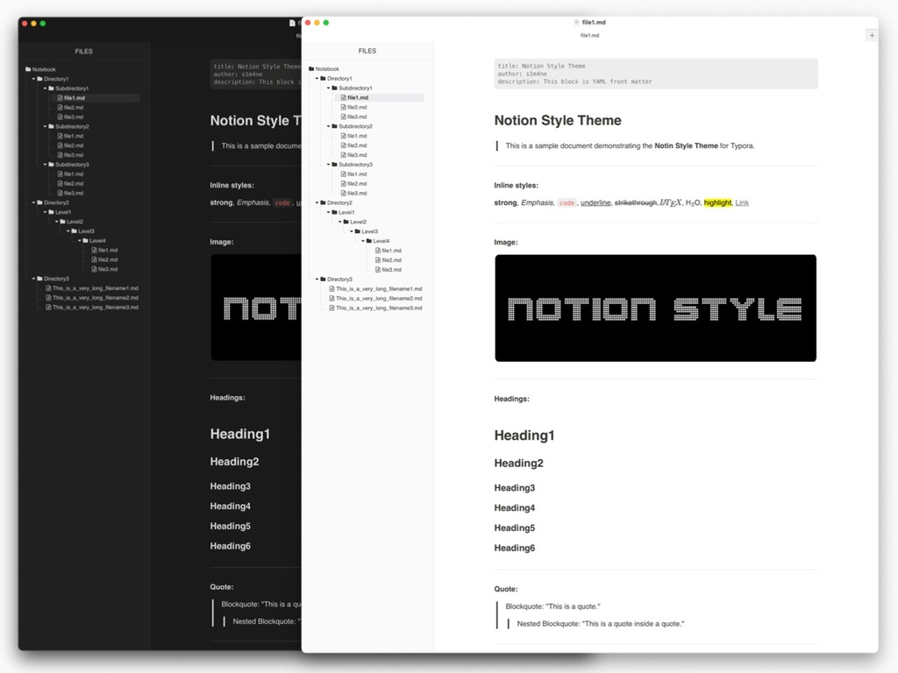
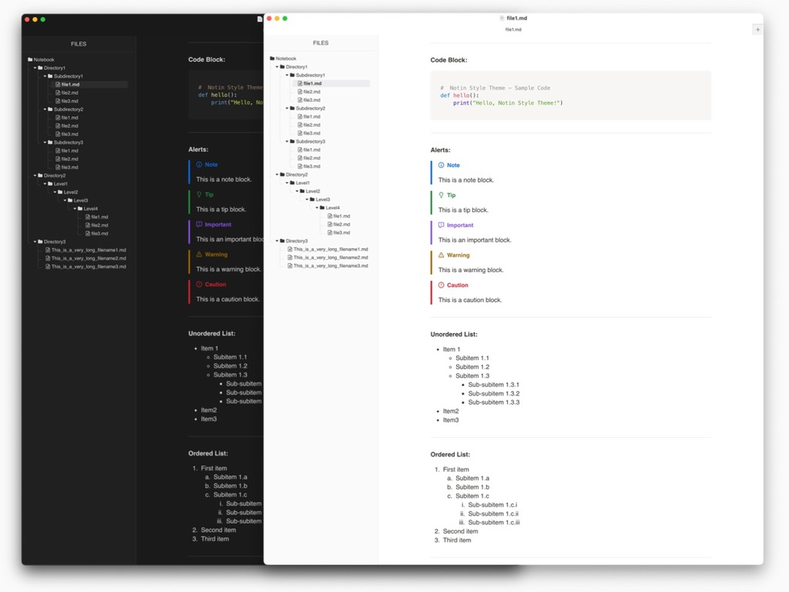
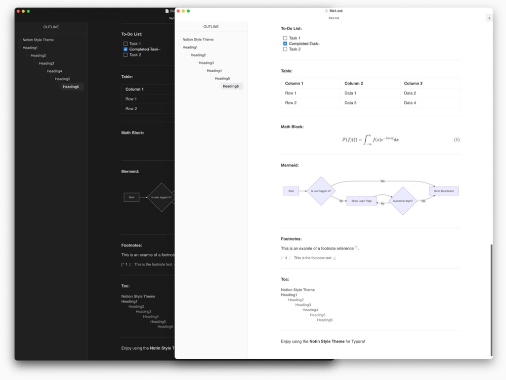

> Designed and tested on macOS. Not fully tested, but should work for Windows/Linux.

# Introduce

- **Notion-like design** for a clean and minimal look.
- **Compact file tree** to display more files and directories.
- **Precise replication** of Notion’s aesthetics.
- The file tree and outline styles are based on [Mdmdt](https://theme.typora.io/theme/Mdmdt/). Adjustments have been made to the size, color, and some elements to better integrate with the overall Notion-like theme.

# Preview

# Installation

Installing this theme is easy—just move the CSS file into Typora's theme directory.

### Steps to Install

1. Download the CSS file (`notion-style-light.css` or `notion-style-dark.css`) from [this link](https://github.com/s1m4ne/typora-theme-notion-style).

2. Open Typora and go to **`Settings` → `Appearance` → `Open Theme Folder`**.

3. Move the downloaded CSS file into the opened theme folder.

4. Restart Typora and go to **`Settings` → `Appearance`** to select the theme(`Notion Style Light` or `Notion Style Dark`).

Now the theme should be applied successfully.

# [Credits](credits.md)

This project is based on _Mdmdt_ for the secondary development of the file tree and outline design. Adjustments have been made to better fit the Notion-like aesthetics.

Special thanks to the creator of _Mdmdt_ for their great design and inspiration.

- [cayxc/Mdmdt](https://github.com/cayxc/Mdmdt)

# License

This project is licensed under the Apache License 2.0.  
See the [LICENSE](LICENSE) file for details.

---

Hope you enjoy this theme! If you do, a ⭐ on [GitHub](https://github.com/s1m4ne/typora-theme-notion-style) would mean a lot. 😊
