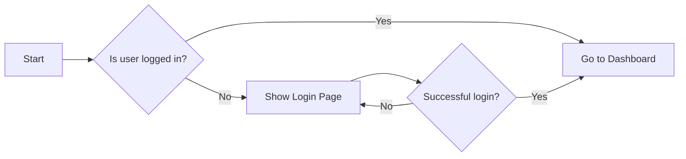

# Notion Style Theme

> This is a sample document demonstrating the **Notion Style Theme** for Typora.

---

**Inline Styles:**

**Bold**, *Italic*, ***Bold Italic***, `inline code`, <u>underline</u>, ~~strikethrough~~, ==highlight==, [Link](https://github.com), www.google.com

**Math & Chemistry:** $E = mc^2$, H$_2$O, $\LaTeX$

**Superscript & Subscript:** X^2^, H~2~O

---

**Image:**


---

**Headings:**

# Heading 1

## Heading 2

### Heading 3

#### Heading 4

##### Heading 5

###### Heading 6

---

**Blockquotes:**

> This is a simple blockquote.

> Blockquote with **bold** and *italic* text.
>
> > Nested blockquote: "A quote inside a quote."

---

**Code Blocks:**

```python
# Python Example
def greet(name):
    print(f"Hello, {name}!")

greet("Notion Style Theme")
```

```javascript
// JavaScript Example
const greeting = (name) => {
    console.log(`Hello, ${name}!`);
};

greeting("Typora");
```

```css
/* CSS Example */
.notion-theme {
    background-color: #ffffff;
    color: #37352f;
    font-family: -apple-system, BlinkMacSystemFont, sans-serif;
}
```

---

**Alerts:**

> [!NOTE]
>
> This is a note block for general information.

> [!TIP]
>
> This is a tip block with helpful suggestions.

> [!IMPORTANT]
>
> This is an important block for critical information.

> [!WARNING]
>
> This is a warning block to alert users of potential issues.

> [!CAUTION]
>
> This is a caution block for dangerous actions.

---

**Unordered List:**

- Item 1
  - Subitem 1.1
  - Subitem 1.2
    - Sub-subitem 1.2.1
    - Sub-subitem 1.2.2
- Item 2
- Item 3

---

**Ordered List:**

1. First item
   1. Subitem 1.a
   2. Subitem 1.b
      1. Sub-subitem 1.b.i
      2. Sub-subitem 1.b.ii
2. Second item
3. Third item

---

**To-Do List:**

- [ ] Pending task
- [x] Completed task
- [ ] Another pending task

---

**Table:**

| Feature       | Status      | Notes            |
| ------------- | ----------- | ---------------- |
| Dark Mode     | Complete    | Fully supported  |
| Light Mode    | Complete    | Fully supported  |
| Code Blocks   | Complete    | Syntax highlight |
| Alerts        | Complete    | 5 types          |

---

**Math Block:**

$$
\mathcal{F}(f)(\xi) = \int_{-\infty}^{\infty} f(x) e^{-2\pi i x \xi} dx
$$

$$
\sum_{n=1}^{\infty} \frac{1}{n^2} = \frac{\pi^2}{6}
$$

---

**Mermaid Diagram:**



---

**Footnotes:**

This is an example of a footnote reference[^1]. Here is another one[^2].

[^1]: This is the first footnote.
[^2]: This is the second footnote with more details.

---

**Horizontal Rules:**

The lines above and below are horizontal rules (---).

---

**Table of Contents:**

[toc]

---

Enjoy using the **Notion Style Theme** for Typora!
